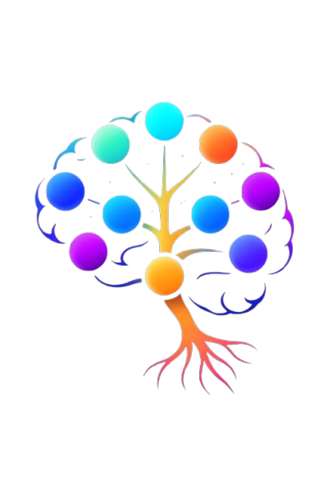

<div align="center">
  

  # MindQ Lab
  ### Explore the Depths of Your Mind

  <p align="center">
    A cutting-edge platform bridging the gap between <b>Psychology</b>, <b>Mindfulness</b>, and <b>Technology</b>.<br/>
    Featuring interactive experiments, cognitive games, and deep psychological insights.
  </p>

  <p align="center">
    <a href="https://vuejs.org/">
      
    </a>
    <a href="https://nuxt.com/">
      
    </a>
    <a href="https://tailwindcss.com/">
      
    </a>
    <a href="https://firebase.google.com/">
      
    </a>
    <a href="https://www.sanity.io/">
      
    </a>
  </p>
</div>

<br />

## 📖 About The Project

**MindQ Lab** is a comprehensive web application designed to help users understand themselves better through interactive tools and scientific frameworks. It combines rigorous psychological models with engaging gamification to create a unique self-discovery experience.

Whether you're looking to test your cognitive abilities, explore your personality traits, or simply find a moment of peace, MindQLab provides the tools you need.

---

## 🌟 Key Features

### 🧠 The Laboratory
Dive into our suite of interactive psychological tools:

*   **🧪 Experiments**
    *   **Big 5 Model**: Discover your personality profile based on the Five Factor Model.
    *   **Wheel of Life**: Visualize and balance different areas of your life.
    *   **Emotional Compass**: Navigate and understand your emotional landscape.
    *   **Daily Growth Spark**: Track your daily progress and insights.
    *   **Life Purpose Archetype**: Uncover your driving purpose.

*   **🎮 Cognitive Games**
    *   **Stroop Test**: Challenge your reaction time and cognitive flexibility.
    *   **N-Back**: Push the limits of your working memory.
    *   **Digit Span**: Test your short-term memory capacity.
    *   **Reaction Time**: Measure your neural processing speed.

*   **🧘 Mindfulness & Psychology**
    *   **Ego States**: Explore Transactional Analysis concepts interactively.
    *   **Healing Trauma**: Guided resources for emotional recovery.
    *   **Brain Map**: Interactive visualization of brain functions.
    *   **Podcasts**: Curated audio content for mental growth.

### 📚 Knowledge Base
*   **Blog**: Deep dives into psychological concepts, powered by Sanity CMS.
*   **Community**: Connect with others on the journey of self-improvement.

---

## 🛠️ Technology Stack

This project is built with a modern, performance-oriented stack:

*   **Frontend Framework**: [Nuxt 3](https://nuxt.com/) (Vue 3)
*   **Styling**: [Tailwind CSS](https://tailwindcss.com/) (v4) & FontAwesome
*   **State Management**: [Pinia](https://pinia.vuejs.org/)
*   **Backend & Auth**: [Firebase](https://firebase.google.com/) (Auth, Firestore, Storage)
*   **Content Management**: [Sanity.io](https://www.sanity.io/)
*   **Animations**: [GSAP](https://greensock.com/gsap/) & Canvas Confetti
*   **Audio**: [Tone.js](https://tonejs.github.io/)
*   **Data Visualization**: [Chart.js](https://www.chartjs.org/)
*   **Utilities**: [VueUse](https://vueuse.org/)

---

## 🚀 Getting Started

Follow these steps to get a local copy up and running.

### Prerequisites

*   Node.js (v18 or higher recommended)
*   npm or yarn

### Installation

1.  **Clone the repository**
    ```bash
    git clone https://github.com/yourusername/mindqlab.git
    cd mindqlab
    ```

2.  **Install dependencies**
    ```bash
    npm install
    # or
    yarn install
    ```

3.  **Set up Environment Variables**
    Create a `.env` file in the root directory and add your configuration keys:
    ```env
    # Firebase Configuration
    FIREBASE_API_KEY=your_api_key
    FIREBASE_AUTH_DOMAIN=your_project_id.firebaseapp.com
    FIREBASE_PROJECT_ID=your_project_id
    FIREBASE_STORAGE_BUCKET=your_project_id.appspot.com
    FIREBASE_MESSAGING_SENDER_ID=your_sender_id
    FIREBASE_APP_ID=your_app_id
    FIREBASE_MEASUREMENT_ID=your_measurement_id

    # Sanity Configuration
    SANITY_PROJECT_ID=wlg2lkvy
    SANITY_DATASET=production

    # Other
    NUXT_PUBLIC_SITE_URL=http://localhost:3000
    NUXT_PUBLIC_PAYPAL_CLIENT_ID=your_paypal_client_id
    ```

4.  **Run the development server**
    ```bash
    npm run dev
    ```

5.  **Open your browser**
    Navigate to `http://localhost:3000` to see the application.

---

## 📂 Project Structure

```bash
├── api/             # API handlers
├── assets/          # Static assets (CSS, images)
├── components/      # Reusable Vue components
├── composables/     # Nuxt composables (auto-imported)
├── layouts/         # Page layouts (default, laboratory, etc.)
├── pages/           # Application routes
├── plugins/         # Nuxt plugins (Firebase, Auth, etc.)
├── public/          # Public static files
├── server/          # Server-side routes
├── stores/          # Pinia state stores
└── utils/           # Utility functions
```

---

## 🤝 Contributing

Contributions are what make the open source community such an amazing place to learn, inspire, and create. Any contributions you make are **greatly appreciated**.

1.  Fork the Project
2.  Create your Feature Branch (`git checkout -b feature/AmazingFeature`)
3.  Commit your Changes (`git commit -m 'Add some AmazingFeature'`)
4.  Push to the Branch (`git push origin feature/AmazingFeature`)
5.  Open a Pull Request

---

## 📄 License

Distributed under the MIT License. See `LICENSE` for more information.

---

<div align="center">
  <p>Built with ❤️ by the MindQLab Team</p>
</div>
